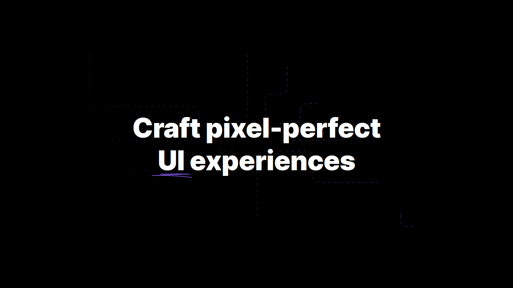

[live]: https://dreisss.github.io/rkt-ignite-nitro-design/

# Ignite Nitro Design

Projeto clonado da live _Ignite Nitro Design_ da [**Rocketseat**](https://www.rocketseat.com.br/) (27/04/23).

[**Live**][live] | [**Tecnologias**](#rocket-tecnologias)

[][live]

## :rocket: Tecnologias

Esse projeto foi feito utilizando as seguintes tecnologias:

- NextJS, React e TypeScript
- CSS
- Framer Motion
- Git e Github
